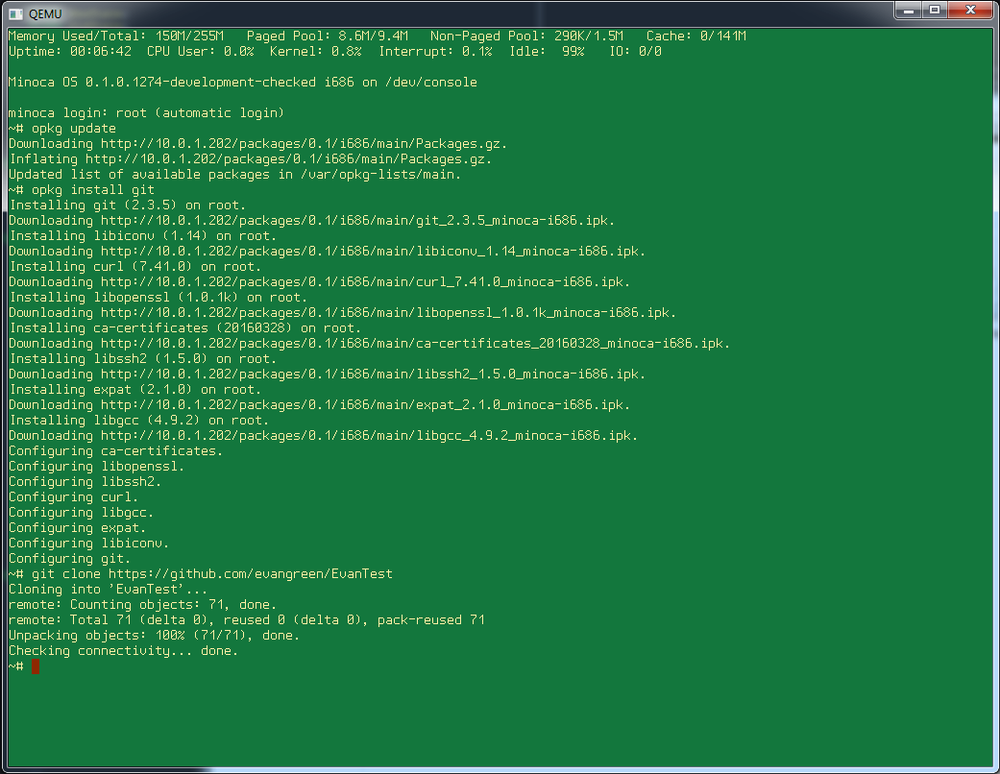
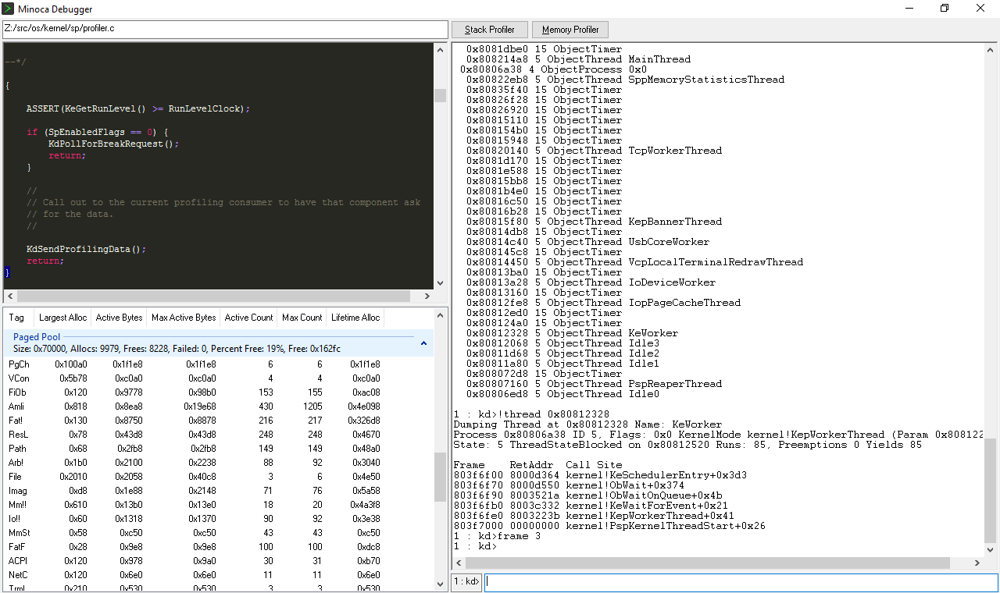
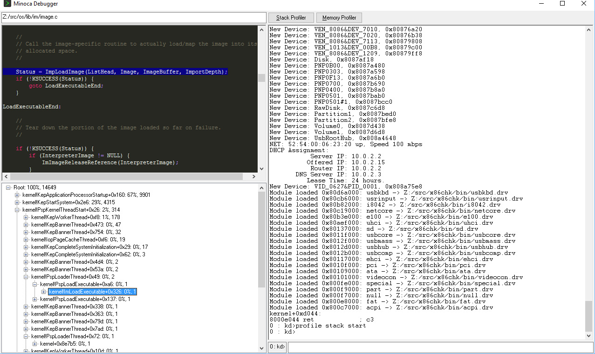

# Minoca OS

Minoca OS is a general purpose operating system written from scratch. It aims to be lean, maintainable, modular, and compatible with existing software. It features a POSIX-like interface towards application software, and a growing suite of popular packages already built and ready to go. On the backend, it contains a powerful driver model between device drivers and the kernel. The driver model enables drivers to be written in a forward compatible manner, so that kernel level components can be upgraded without necessarily requiring a recompilation of all device drivers.

Minoca OS is event driven, preemptible, SMP ready, and network capable. It currently runs on x86 PCs and a range of ARM boards.

### Screenshots

### Getting Started
If you're just looking to try out Minoca OS, head over to our [download](https://www.minocacorp.com/download/) page to grab the latest stable images. The rest of this page describes how to use this repository to build your own custom image of Minoca OS.

## Building Minoca OS
The paragraphs below will get you from a fresh clone to a built image.

### Environment
The Minoca OS build environment is keyed off of a few environment variables you'll need to set in order to orient the build system:
 - `SRCROOT` - Contains the absolute path to the base source directory. This respository is expected to be in a directory called `os` inside `SRCROOT`. If the third-party or tools repositories are present, they should be in directories called `third-party` and `tools` respectively underneath `SRCROOT`. For example, if you had checked out this repository into `~/src/os`, then in your shell you'd run `export SRCROOT=~/src`.
 - `ARCH` - Contains the architecture to build Minoca OS for (aka the target architecture). Valid values are `armv6`, `armv7`, and `x86`.
 - `VARIANT` - Contains the architecture variant, if any. Leave this unset most of the time. Currently the only valid value is `q` for the `x86` architecture, which builds for the Intel Quark.
 - `DEBUG` - Describes whether to build Minoca OS for debugging or release. Valid values are `dbg` for debug or `rel` for release. We always build `dbg`.
 - `PATH` - You'll need to have `$SRCROOT/$ARCH$VARIANT$DEBUG/tools/bin` in your path to build successfully.

### Prerequisites
To build Minoca OS you'll need a Minoca-specific toolchain for the particular architecture you're building. Prebuilt toolchains can be found [here](https://www.minocacorp.com/download/#toolchain). If you want to build the toolchain from sources, you'll need to check out the [third-party](https://gitlab.com/minoca/third-party) repository and run "make tools" in there.
> Note: If you want to build your own toolchain on Windows, you may find the [tools](https://gitlab.com/minoca/tools) repository helpful, as it contains a native MinGW compiler, make, and other tools needed to bootstrap a toolchain on Windows.

### Build
Run `make` to build the OS for the particular architecture you've supplied. Parallel make is supported. The final output of the build will be several .img files located in `$SRCROOT/$ARCH$VARIANT$DEBUG/bin/*.img`. For example, the PC image is usually located at `$SRCROOT/x86dbg/bin/pc.img`. This is a raw hard disk file that can be applied directly to a hard drive or USB stick to boot Minoca OS. The image `install.img` is a generic installation archive that the `msetup` tool can use to create new Minoca OS installations on target disks or partitions.

Object files are generated in `$SRCROOT/$ARCH$VARIANT$DEBUG/obj/os`. You can run `make clean`, or simply delete this directory, to cause the os repository to completely rebuild. Alternatively, you can run `make wipe` to delete all generated files, including the third-party tools you built or downloaded. Running `make wipe` simply deletes `$SRCROOT/$ARCH$VARIANT$DEBUG/`. We usually stick to `make clean` since `make wipe` requires a complete rebuild of the toolchain.

### Running
To boot your built images, you can write the appropriate image for the platform you're trying to boot to a USB flash drive or hard disk. On Windows, you can use the Win32DiskImager tool (included in the [tools](https://gitlab.com/minoca/tools) repository under win32/Win32DiskImager). You can also use the msetup tool to build custom images. If you use the msetup tool to install Minoca OS onto a partition of a disk containing other partitions that you care about (such as on the same machine you're building from), we highly recommend making a complete backup of your disk. Minoca OS is still new, and we wouldn't want a bad bug to wipe out all your data.

If you're building Minoca OS on Windows and have downloaded the [tools](https://gitlab.com/minoca/tools) repository, several shortcuts have been set up to allow you to quickly run a Qemu instance with the images you've just built. Make sure you fired up the development environment with the setenv.cmd script. Type `run`, then `dx` to fire up an x86 Qemu instance of pc.img with a kernel debugger attached. We use this internally for faster development. If building for ARM, it's `runarm` and `da`.

### Nickel Tour
Below is a brief orientation of a few of the directories in the repository. Check the Makefile in each directory for a more detailed description of what that directory contains.
 * `apps` - User mode applications and libraries
   * `ck` - Chalk, an embeddable scripting language
   * `debug` - Debugger application
   * `libc` - The Minoca OS C Library
   * `osbase` - The Minoca kernel API library
   * `setup` - The msetup build tool
   * `swiss` - POSIX tools in a box
 * `boot` - Executables used during system boot
   * `mbr` - The Master Boot Record
   * `fatboot` - The Volume Boot Record for FAT file systems
   * `bootman` - The Minoca Boot Manager
   * `loader` - The Minoca OS loader
   * `lib` - Libraries shared across multiple boot executables
 * `drivers` - Device drivers
   * `acpi` - ACPI platform driver, with AML interpreter
   * `fat` - FAT file system driver
   * `gpio` - GPIO core library and SoC drivers
   * `net` - Networking support
     * `ethernet` - Wired ethernet controller drivers
     * `net80211` - Core 802.11 support
     * `netcore` - Core networking support (TCP, UDP, IP, ARP, etc)
     * `wireless` - 802.11 wireless controller drivers
   * `pci` - PCI support
   * `sd` - SD/MMC support
   * `spb` - Serial Peripheral Bus drivers (I2C, SPI)
   * `special` - Special devices (/dev/null, full, zero)
   * `usb` - USB support
     * `ehci` - EHCI host controller support
     * `usbcomp` - USB composite device support
     * `usbhub` - USB hub support
     * `usbkbd` - USB keyboard support
     * `usbmass` - USB mass storage support
   * `usrinput` - User input device support
   * `videocon` - Video terminal console driver
 * `images` - Recipes to create the final images for each supported platform
 * `include` - Public header files
 * `kernel` - The Minoca OS kernel
   * `ke` - High level executive functions
   * `mm` - Memory management
   * `io` - Input/Output subsystem
   * `kd` - Kernel debug support
   * `hl` - Low level hardware layer support
   * `ob` - Object management
   * `ps` - Process and thread management
   * `sp` - System profiler support
 * `lib` - Common libraries used throughout boot, kernel, and user mode.
   * `basevid` - Library for drawing text on a framebuffer
   * `fatlib` - FAT file system library
   * `im` - ELF/PE image library
   * `partlib` - Partition library
   * `rtl` - General runtime library (printf, date/time, memcpy, etc)
   * `termlib` - Terminal support library
 * `tasks` - Internal automation configuration
 * `uefi` - Minimal UEFI implementation for platforms supported by Minoca OS.
   * `core` - Platform-agnostic UEFI firmware core
   * `dev` - UEFI device libraries
   * `plat` - Recipes and code for specific platforms
     * `beagbone` - BeagleBone Black firmware
     * `bios` - UEFI over BIOS firmware
     * `integcp` - Integrator/CP firmware (for ARM Qemu)
     * `panda` - TI PandaBoard firmware
     * `rpi` - Raspberry Pi 1 firmware
     * `rpi2` - Raspberry Pi 2 and 3 firmware
     * `veyron` - Asus C201 Chromebook firmware
   * `tools` - Tools used in building final firmware images

## Contributing
Submissions are welcome! See our [CONTRIBUTING.md](CONTRIBUTING.md) page for details, or our [WISHLIST.md](WISHLIST.md) page for suggestions. Bugs can be reported here on Github.

## License
Minoca OS is licensed to the public under the terms of the GNU General Public License, version 3. Alternate licensing options are available. Contact info@minocacorp.com if your company is interested in licensing Minoca OS. For complete licensing information, see the [LICENSE](LICENSE) file in this repository.

## Contact
 * Email: minoca-dev@googlegroups.com
   * Contact security@minocacorp.com for security related issues.
   * Contact info@minocacorp.com for private or business inquries.
 * Website: [http://www.minocacorp.com/](http://www.minocacorp.com)
 * Github: [https://github.com/minoca](https://github.com/minoca)
 * Gitlab: [https://gitlab.com/minoca](https://gitlab.com/minoca)
